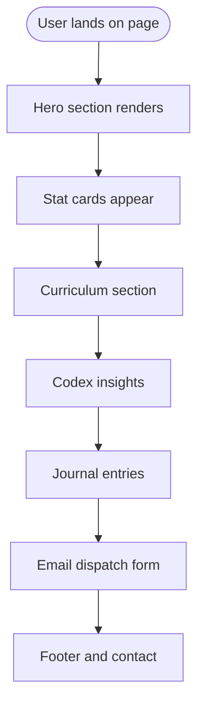
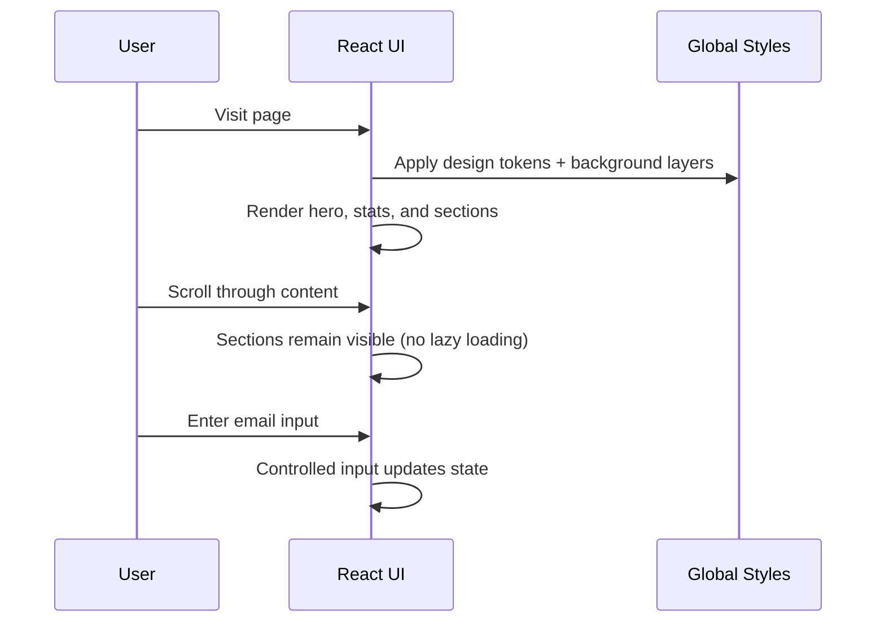
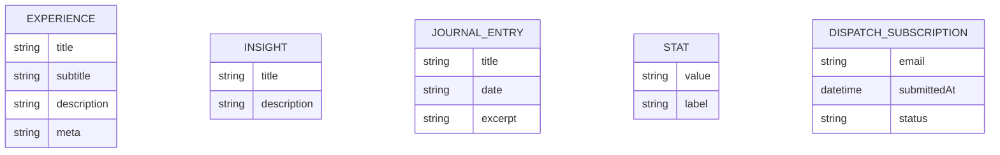

# Project Architecture Document — L’Artisan Baking Atelier

## 1) Purpose
This Project Architecture Document (PAD) is the single source of truth for how the application is structured, how it behaves, and how contributors should reason about changes. It is designed to onboard new developers or AI agents quickly and consistently.

---

## 2) Project Summary
**L’Artisan Baking Atelier** is a cinematic, single‑page React application that presents a boutique e‑commerce concept for artisan baking education in Singapore. The experience is intentionally minimal yet atmospheric, using a noir palette, editorial typography, and strict visual hierarchy.

**Primary goals**
- Present the brand narrative and curriculum through a premium, editorial interface
- Keep the codebase small, composable, and easy to extend
- Maintain a CSS‑driven design system with minimal dependencies

---

## 3) Tech Stack & Build System
- **React 19 + TypeScript** (single page composition)
- **Vite 7** (build + dev server)
- **Tailwind CSS 4** (CSS‑first configuration via `@theme` in `index.css`)
- **vite-plugin-singlefile** (portable output)

---

## 4) Application Architecture

### 4.1 File Hierarchy (Key Files)
```
root/
├─ index.html                  # HTML shell + mount point
├─ package.json                # Scripts and dependencies
├─ tsconfig.json               # TypeScript strict configuration
├─ vite.config.ts              # Vite/Tailwind single-file build config
├─ README.md                   # Project overview and usage
├─ Project_Architecture_Document.md  # This architecture handbook
└─ src/
   ├─ main.tsx                 # React entry point
   ├─ App.tsx                  # Root layout + section composition
   ├─ index.css                # Design tokens + global styles
   ├─ utils/
   │  └─ cn.ts                 # Utility for className merging
   └─ components/
      ├─ ExperienceCard.tsx    # Curriculum/experience card
      ├─ InsightCard.tsx       # Codex/insight panel
      ├─ JournalEntry.tsx      # Editorial entry
      ├─ Ornament.tsx          # Decorative SVG flourish
      ├─ SectionHeader.tsx     # Reusable header system
      └─ StatCard.tsx          # KPI/stat tile
```

### 4.2 Component Map
- **App.tsx**: Composes the page; defines data arrays for experiences, insights, journal entries, and assembles sections.
- **SectionHeader**: Shared typography layout for section headings.
- **ExperienceCard / InsightCard / JournalEntry / StatCard**: Core content blocks, each owning a discrete visual pattern.
- **Ornament**: Decorative SVG element to anchor section identity.

### 4.3 Data & State
- No external data source; the content is defined as **static arrays** in `App.tsx`.
- No global state management; simple React rendering only.
- One local input in the dispatch form (no backend submission in the current implementation).

---

## 5) User & Application Interaction


---

## 6) Application Logic Flow


---

## 7) Data Model (Logical Schema)
> The project is currently **frontend‑only** with no backend persistence. The schema below documents the logical entities represented in `App.tsx` and can guide future API or database design.



---

## 8) Styling & Design System
- **Design tokens** live in `src/index.css` inside `@theme`.
- **Typography**: Bodoni Moda (display), Manrope (body).
- **Palette**: Void‑black base, amber highlights, and neutral ink tones.
- **Layout**: Wide spacing, editorial grids, subtle gradients, and minimal ornamentation.

---

## 9) Accessibility & Performance
- Semantic HTML5 structure
- Minimal runtime dependencies
- CSS‑first styling and animation to avoid JS overhead
- Lightweight Vite build with single‑file output

---

## 10) Deployment
### Local Build
```bash
npm run build
```

### Hosting Targets
- **Vercel**: Build `npm run build`, output `dist`
- **Netlify**: Build `npm run build`, publish `dist`
- **GitHub Pages**: `npm run build` then `npx gh-pages -d dist`

---

## 11) Contribution Guidance
- Keep the experience cinematic and minimal.
- Prefer small, composable components over large templates.
- Update design tokens in `index.css` rather than adding ad‑hoc CSS.
- Preserve existing typography and spacing rhythm unless explicitly redesigning.

---

## 12) Known Gaps / Future Extensions
- No backend or persistence layer (consider API integration for subscriptions).
- No test suite (optional: add unit tests for components).
- No animation system beyond CSS transitions.

---

## 13) Validation Notes
- This PAD matches the current file structure in the repository.
- The diagrams describe the actual page flow and data model used in `App.tsx`.
- No database exists in code; ER diagram is a **logical** representation for future planning.
