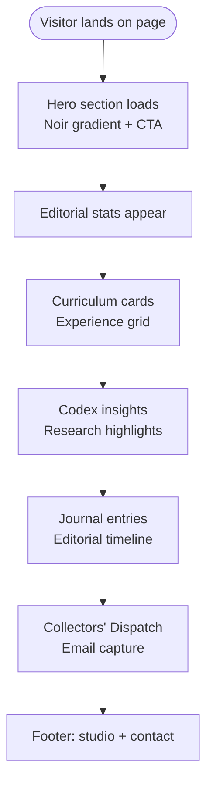
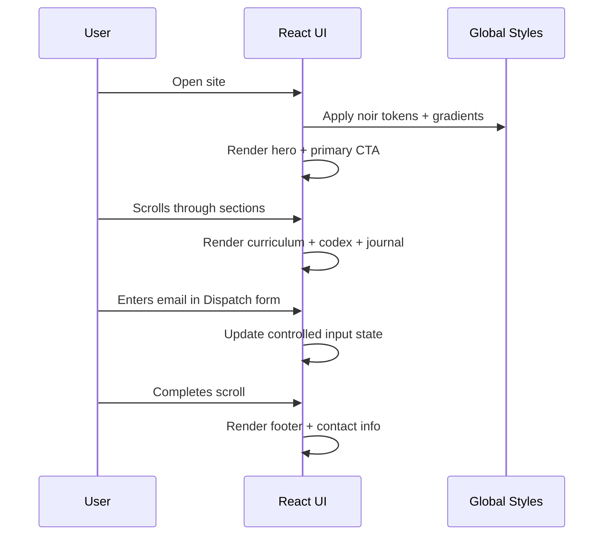

# L’Artisan Baking Atelier — Singapore

A cinematic, avant‑garde single‑page e‑commerce concept for an artisan baking school. This project pairs editorial composition with atmospheric noir visuals, tailored for Singapore’s heritage and craft narrative.

---

## Overview

**L’Artisan Baking Atelier** is a boutique digital experience built to showcase a high‑end baking curriculum through immersive storytelling, measured typography, and disciplined spatial rhythm. The UI emphasizes scarcity, ritual, and refinement — transforming a course catalog into a cinematic narrative.

**Core highlights**
- Editorial hero with shimmering display typography and ambient gradients.
- Modular curriculum and research “Codex” blocks.
- Journal‑style editorial entries and collectors’ dispatch form.
- Minimal component system with reusable, purpose‑built primitives.

---

## Tech Stack

- **React 19 + TypeScript**
- **Vite 7**
- **Tailwind CSS 4 (CSS‑first configuration)**
- **vite-plugin-singlefile** for portable output

---

## Quick Start

```bash
# Install dependencies
npm install

# Start development server
npm run dev

# Production build
npm run build
```

---

## Application Architecture

### File Hierarchy (Key Files)

```
root/
├─ index.html                  # HTML shell + app mount
├─ package.json                # Scripts and dependencies
├─ tsconfig.json               # TypeScript strict settings
├─ vite.config.ts              # Vite + Tailwind + single-file build
└─ src/
   ├─ main.tsx                 # React entry point
   ├─ App.tsx                  # Page composition + section layout
   ├─ index.css                # Design tokens + global styles
   ├─ utils/
   │  └─ cn.ts                 # Utility for className merging
   └─ components/
      ├─ ExperienceCard.tsx    # Curriculum card
      ├─ InsightCard.tsx       # Research/insight card
      ├─ JournalEntry.tsx      # Editorial entry
      ├─ Ornament.tsx          # Decorative SVG motif
      ├─ SectionHeader.tsx     # Shared section header
      └─ StatCard.tsx          # KPI panel
```

### Architectural Notes

- **App.tsx** orchestrates the entire single‑page narrative: hero, curriculum, codex, journal, and dispatch.
- **SectionHeader** standardizes each section’s typographic hierarchy.
- **ExperienceCard / InsightCard / JournalEntry / StatCard** serve as the core modular primitives.
- **index.css** defines the noir palette, ambient gradients, and global typographic tokens.

---

## User Interaction Flow



---

## Application Logic Flow



---

## Design System Notes

- **Typography:** Bodoni Moda for display, Manrope for body text.
- **Palette:** Deep void base with amber highlights and restrained neutral ink.
- **Texture:** Ambient radial gradients and low‑opacity noise overlay.
- **Motion:** Subtle fade‑ups and shimmer to emphasize hierarchy without clutter.

---

## Deployment

### Local Production Build

```bash
npm run build
```

### Static Hosting (Vercel / Netlify / GitHub Pages)

- Output is generated in `dist/`.
- `vite-plugin-singlefile` produces a single self‑contained HTML artifact.

**Vercel**
- Framework preset: **Vite**
- Build command: `npm run build`
- Output directory: `dist`

**Netlify**
- Build command: `npm run build`
- Publish directory: `dist`

**GitHub Pages**
```bash
npm run build
npx gh-pages -d dist
```

---

## Accessibility & Performance

- Semantic HTML structure with clear hierarchy.
- CSS‑only motion for reliable performance.
- Minimal dependency footprint.

---

## License

MIT
